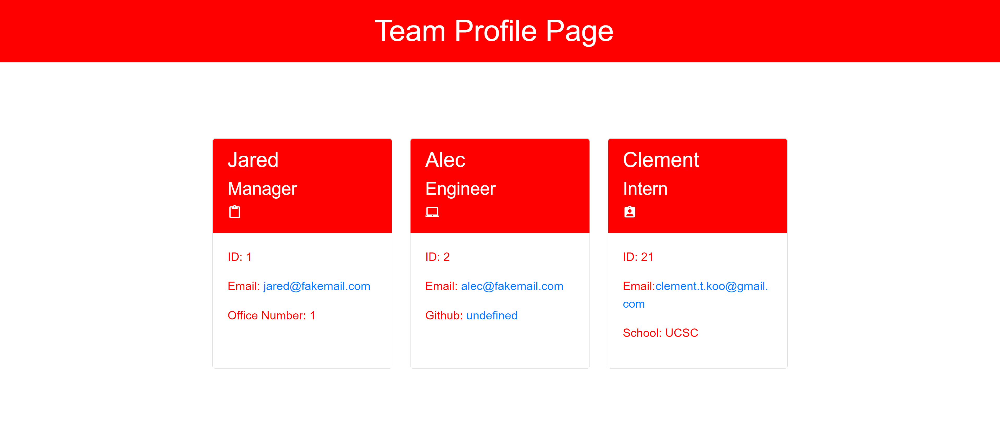

# Team Profile Generator
### The following is a commnad line application built using Node.js, it takes in some quick info on the members of a software engineering teeam and quickly generates a profile for each of its member. The user will first be prompted information to quickly generate a summary for the team manager, and then the rest of the team will follow through.

## Table of Contents

- [Technologies](#technologies)
- [Code Snippets](#code-snippets)
- [Software Demo](#demo)
- [Credits](#credits)
  

## Technologies Used
- Javascript
- Node.js


## Code Snippets
The following snippet appears to be nothing special without context, but it is a sign of my growth from learning more on how to utilize the Inquirer prompt. Compared to what I've done for the README generator, I've decided to research and learn a variety of different ways I can phrase my prompts for the user, and make it work.
```java
const add_Employee = () =>{
    return inquirer.prompt([
        {
            type: 'confirm',
            name: 'AddEmployee',
            message: 'Would you like to add another member?',
            default: false
        }
    ]).then((response)=>{
```

## Demo

<br>

<br>

## Credits

UCB - Coding Bootcamp


## License

[](https://opensource.org/licenses/MIT)

---

© 2022 Clement Koo. All Rights Reserved.
[LinkdIn](https://www.linkedin.com/in/clement-t-k-459322138/) |
[GitHub](https://github.com/C-K999)